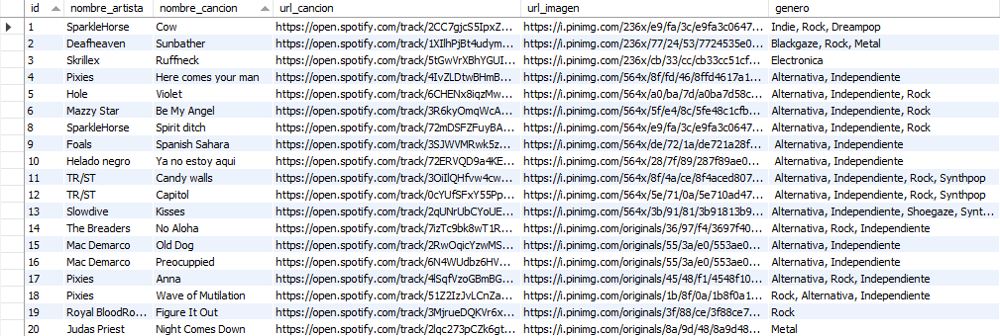
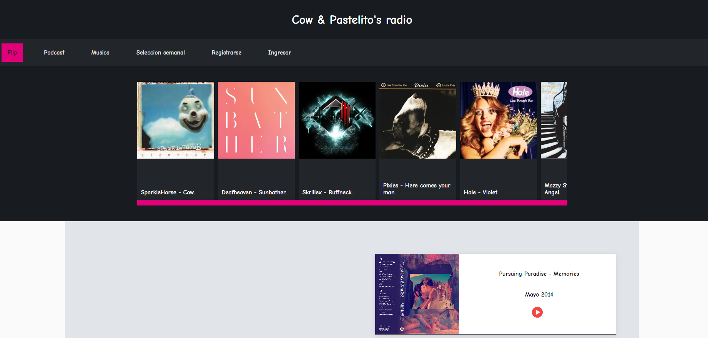
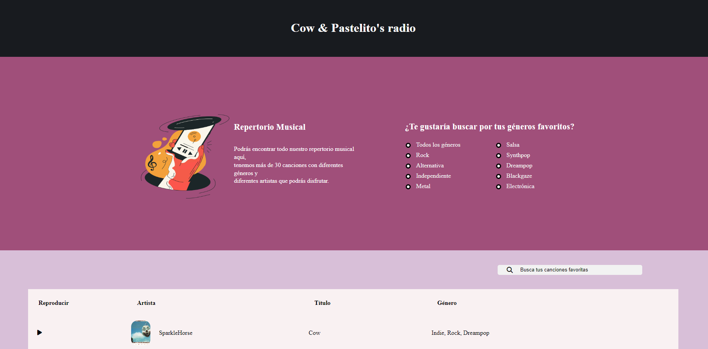
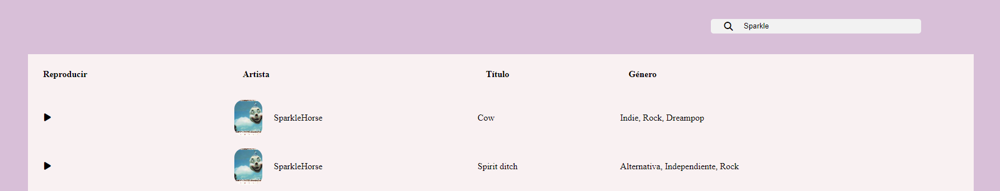
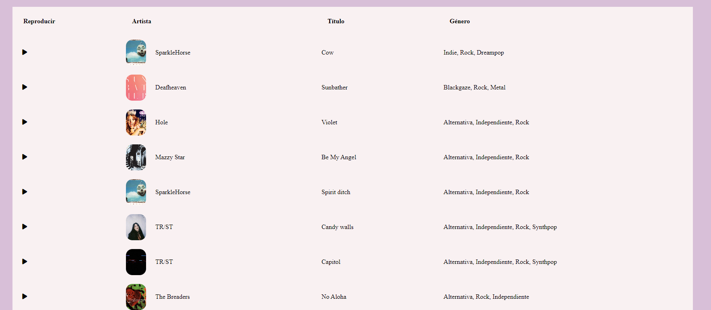

# Cow & Pastelito's Radio

Hi there!

Welcome to Cow & Pastelito's radio, 
a digital platform dedicated to bringing 
abi unique experience in music and podcasts. We are passionate about music and truly believe in the power of podcasts to inform, entertain, and connect people.

### What's Cow & Pastelito's Radio ?

Basically, Cow & Pastelito's Radio is a music 
catalog that allows you to explore different 
genres and discover interesting podcasts about 
history, politics, and even entertainment.

### Which tecnologies we used in our project ? 
 

1. Java 17
2. JavaScript
3. HTML & CSS
4. IntelliJ & VisualStudio
5. Spring Framework & SpringBoot
6. Spring Security and JWT
7. Spring JPA - Hibernate 
8. MySQL Workbench 
9. Lombok library
10. Trello

### How does it works ? 

In the first place, we have a database on localhost 
that contains our songs along with their information. 
We utilize our Service classes to access this d
d retrieve songs based on various parameters such 
as artist name, song name, and even genres.

 

Our webpage sends a request to the controller
to retrieve all songs and display them.
 

In the other hand, we have another html file where
we are able to send a personalized

#### Filter by search

#### Filter by gender (Example - Rock)

